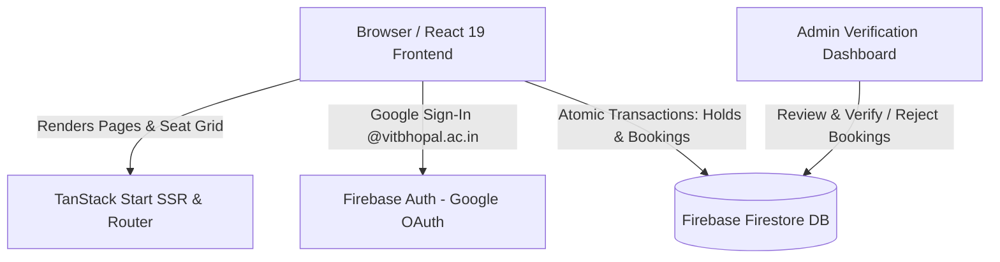
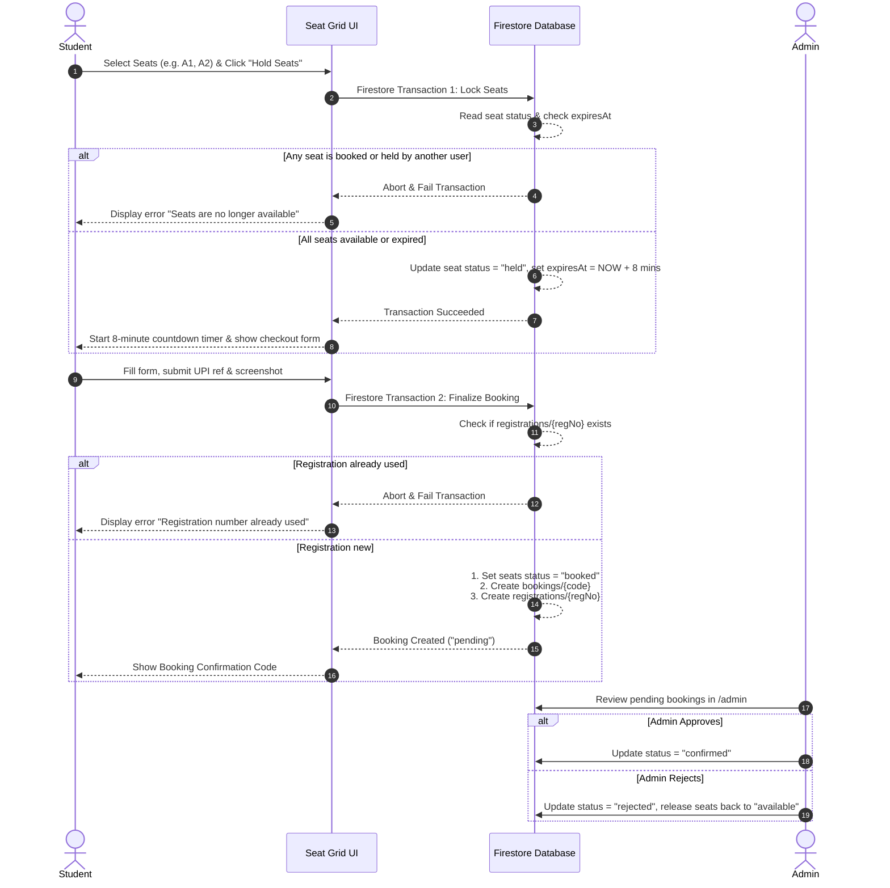

# 🏛️ Technical Architecture & System Design

This document details the architectural design, data models, state machines, and security mechanisms powering the **AWS F1 Screening Ticket Booking System**.

---

## 🏗️ System Overview



The system is designed as a client-first, serverless web application using **TanStack Start** (React 19, TypeScript, Vite) connected directly to **Firebase Firestore** and **Firebase Auth**.

---

## 🗄️ Firestore Database Schema

Firestore collections are organized into 4 primary collections:

```
Firestore Root
├── 📁 seats/
│   └── 📄 {seatId}              (e.g., "A1", "B7")
│       ├── seatId: string       (e.g. "A1")
│       ├── row: string          (e.g. "A")
│       ├── number: number       (e.g. 1)
│       ├── tier: string         ("VIP" | "Executive" | "General")
│       ├── price: number        (e.g. 150)
│       ├── status: string       ("available" | "held" | "booked")
│       ├── heldBy: string       (User UID / RegNo)
│       ├── heldAt: Timestamp    (Creation time of hold)
│       └── expiresAt: Timestamp (8 minutes from heldAt)
│
├── 📁 bookings/
│   └── 📄 {bookingCode}         (e.g., "F1-X8K9L2")
│       ├── bookingCode: string  (Unique alphanumeric code)
│       ├── name: string
│       ├── email: string        (Must be @vitbhopal.ac.in)
│       ├── regNo: string        (Student registration number)
│       ├── phone: string
│       ├── seats: string[]      (Array of seat IDs, e.g. ["A1", "A2"])
│       ├── totalAmount: number
│       ├── upiRef: string       (12-digit transaction reference)
│       ├── screenshotUrl: string (Base64 JPEG data URL or Storage link)
│       ├── status: string       ("pending" | "confirmed" | "rejected")
│       ├── createdAt: Timestamp
│       └── verifiedBy: string   (Admin email upon review)
│
├── 📁 registrations/
│   └── 📄 {regNo}               (e.g., "24BCE10303")
│       ├── regNo: string
│       ├── bookingCode: string
│       ├── email: string
│       └── createdAt: Timestamp
│
└── 📁 screenshots/
    └── 📄 {bookingCode}
        ├── data: string         (Compressed JPEG canvas payload)
        └── uploadedAt: Timestamp
```

---

## ⚡ Concurrency & Transaction Flow

To guarantee zero double-bookings under heavy concurrent traffic during ticket launches, the system implements **ACID Transactions**:



---

## 🛡️ Security & Role-Based Access Control

1. **Authentication**:
   - Google Sign-In enforces the domain restriction `ALLOWED_DOMAIN` (`vitbhopal.ac.in`).
2. **Authorization (`/admin`)**:
   - Organizers are verified against `ADMIN_EMAILS` defined in [`src/lib/event-config.ts`](file:///src/lib/event-config.ts) and backed up by `firebase/firestore.rules`.
3. **Database Security Rules**:
   - Participants can only create pending bookings for held seats during active transactions.
   - Only authenticated organizers can update booking statuses or read the `screenshots` collection.

---

## 🧰 Performance & Optimization Techniques

- **Canvas Screenshot Compression**: Payment proof images are compressed in browser memory to JPEG with quality scale ~0.65 and max width 800px before transit, guaranteeing fast uploads and zero cloud storage expenses.
- **Optimistic UI Updates & React Query**: Seat selections and status badges update dynamically with background sync.
- **Single-Pass Seat Pricing**: Layout and pricing tiers are calculated from a unified configuration map in [`src/lib/seat-layout.ts`](file:///src/lib/seat-layout.ts).
