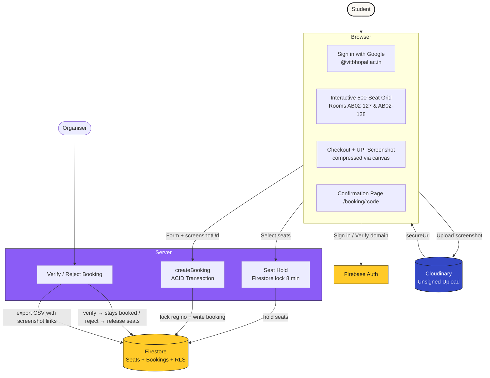
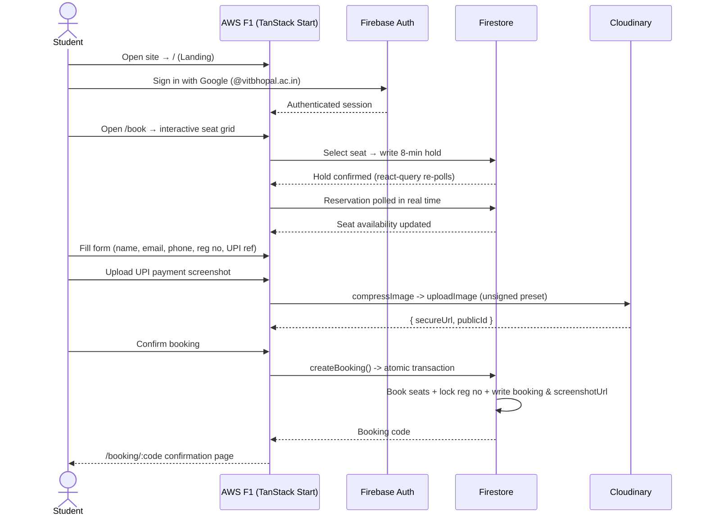
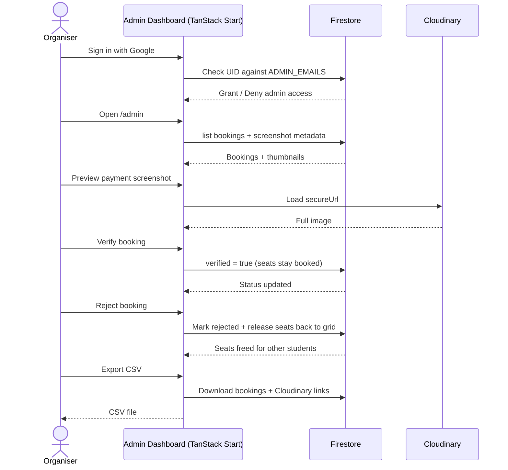
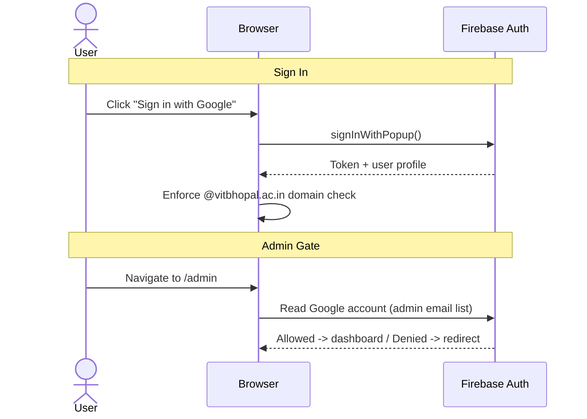

# 🏎️ AWS F1 Screening — Ticket Booking System

<div align="center">


<br />

A full-stack ticket booking system for the **F1 Grand Prix Screening** hosted by **AWS Club VITB** at VIT Bhopal. Real-time seat reservation with ACID Firestore transactions, Cloudinary-powered payment screenshot uploads, and a secure organiser verification dashboard.

**Live → [f1gp-aws.vercel.app](https://f1gp-aws.vercel.app)**

</div>

---

## Key Features

- **Real-Time Seat Reservation** — Interactive 500-seat layout across two rooms — **AB02-127 & AB02-128** (250 seats each) — with tiered seating (Pit Lane / Grandstand / Back Straight) and 8-minute atomic Firestore locks to prevent double-booking.
- **One Registration, One Booking** — Database-level uniqueness lock per registration number — no duplicate claims possible.
- **VIT Bhopal Only** — Sign-in restricted to `@vitbhopal.ac.in` Google accounts.
- **Cloudinary Screenshot Uploads** — Client-side compression + unsigned upload to Cloudinary; Firestore stores only the URL, not the image, keeping docs tiny and free-tier friendly.
- **Admin Dashboard** — Google-authenticated organiser panel to verify/reject bookings, view screenshot thumbnails, delete registrants, and export CSV with Cloudinary links.
- **F1-Themed UI** — Glassmorphic design with Tailwind CSS v4, shadcn/ui + Radix primitives, Lucide icons, and Sonner toast alerts.

---

## Workflow Diagram



### Student Booking Flow



### Organiser Verification Flow



### Auth Flow



---

## Tech Stack

| Layer | Technology | Free Tier |
|-------|-----------|-----------|
| Framework | [TanStack Start](https://tanstack.com/start) + React 19 + Tailwind v4 | Yes |
| UI | [shadcn/ui](https://ui.shadcn.com) + Radix primitives | Yes |
| Auth + Database | [Firebase](https://firebase.google.com) (Google OAuth, Firestore, security rules) | 1 GB storage, 50k reads/day |
| Image Upload | [Cloudinary](https://cloudinary.com) (unsigned preset, client-side compress) | 25 GB storage & bandwidth/mo |
| Validation | [Zod](https://zod.dev) + [React Hook Form](https://react-hook-form.com) | Free |
| State | [@tanstack/react-query](https://tanstack.com/query) | Free |
| Build | [Vite 8](https://vitejs.dev) | Free |
| Hosting | [Vercel](https://vercel.com) (Hobby tier) | 100 GB bandwidth/mo |

**Total cost: $0** for personal use.

---

## Repository Structure

```
AWS-F1-Screening/
├── firebase/
│   ├── firestore.rules           # Security rules (auth, transactions, admin gating)
│   └── README.md                 # Firebase + Cloudinary setup walkthrough
├── src/
│   ├── components/
│   │   ├── f1/                   # Domain components (SeatMap, AuthGate, UserBadge)
│   │   └── ui/                   # shadcn/ui primitives (Button, Card, Dialog, etc.)
│   ├── hooks/                    # Custom hooks (useMobile)
│   ├── lib/
│   │   ├── auth-context.tsx      # Firebase Auth React Context
│   │   ├── booking-api.ts        # Firestore transactions, booking CRUD, screenshot helpers
│   │   ├── cloudinary.ts         # Cloudinary unsigned upload client
│   │   ├── event-config.ts       # Event metadata, admin emails, UPI config
│   │   ├── firebase.ts           # Firebase app initialization
│   │   ├── seat-layout.ts        # 2-room layout (AB02-127/128), tiers, pricing
│   │   ├── error-capture.ts      # Centralized error logging
│   │   └── error-page.ts         # Error boundary UI
│   ├── routes/
│   │   ├── __root.tsx            # App shell, Header, AuthGate, Toaster
│   │   ├── index.tsx             # Landing page / hero section
│   │   ├── f1.tsx                # F1 theme / event info page
│   │   ├── book.tsx              # Seat selection + checkout + Cloudinary upload
│   │   ├── admin.tsx             # Organiser dashboard (verify / reject / delete / CSV)
│   │   └── booking.$code.tsx     # Booking confirmation status page
│   └── styles.css                # Tailwind CSS v4 + custom F1 theme
├── .env.example                  # Environment variables template
├── components.json               # shadcn/ui config
├── package.json
└── vite.config.ts
```

---

## Getting Started

### Prerequisites

- **Node.js** >= 18
- **npm** >= 9 (or pnpm / yarn)
- A **Firebase** project (Firestore + Google Auth enabled)
- A **Cloudinary** account (free plan)

### 1. Clone & Install

```bash
git clone https://github.com/N-PCs/AWS-F1-Screening.git
cd AWS-F1-Screening
npm install
```

### 2. Configure Environment

```bash
cp .env.example .env
```

Fill in `.env` with your credentials:

```env
# Firebase (from Firebase console → Project settings → Your apps)
VITE_FIREBASE_API_KEY=
VITE_FIREBASE_AUTH_DOMAIN=
VITE_FIREBASE_PROJECT_ID=
VITE_FIREBASE_APP_ID=
VITE_FIREBASE_STORAGE_BUCKET=
VITE_FIREBASE_SENDER_ID=

# Cloudinary (from Cloudinary dashboard)
VITE_CLOUDINARY_CLOUD_NAME=
VITE_CLOUDINARY_UPLOAD_PRESET=
```

### 3. Set Up Firebase

1. Create a Firestore database (Standard edition, `asia-south1`, production mode)
2. Enable Google sign-in (Authentication → Sign-in method → Google)
3. Paste `firebase/firestore.rules` into the Rules tab → **Publish**
4. Add your domain to Authorized Domains

> Full walkthrough: [`firebase/README.md`](firebase/README.md)

### 4. Set Up Cloudinary

1. Sign up at [cloudinary.com](https://cloudinary.com)
2. Note your **Cloud name** → set as `VITE_CLOUDINARY_CLOUD_NAME`
3. Create an **unsigned** upload preset (Settings → Upload → Upload presets → Add)
4. Set the preset name as `VITE_CLOUDINARY_UPLOAD_PRESET`

### 5. Start Dev Server

```bash
npm run dev
```

Open `http://localhost:3000`.

### Scripts

| Command | Description |
| :--- | :--- |
| `npm run dev` | Vite dev server with HMR |
| `npm run build` | Production build (Vercel preset) |
| `npm run preview` | Preview production build locally |
| `npm run lint` | ESLint |
| `npm run format` | Prettier |

---

## Contributing

We welcome contributions! Please see [CONTRIBUTING.md](CONTRIBUTING.md) for branch naming, code standards, and PR guidelines.

<div align="center">

<a href="https://github.com/N-PCs/AWS-F1-Screening/graphs/contributors">
    
</a>

</div>

---

## License

This project is licensed under the MIT License — see [LICENSE](LICENSE) for details.
